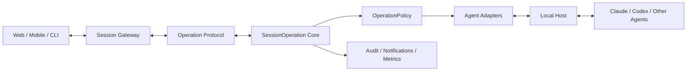

# Kaxu

> 让本地 AI 编程 Agent 变成可跨设备控制、可恢复、可审计、可扩展的工作单元。

[简体中文](README.zh-CN.md)

Kaxu is an open control plane for local coding agents.

AI coding agents are becoming long-running collaborators, but they still live inside isolated terminals. When you leave your desk, approvals wait, failures go unnoticed, and every agent exposes a different control model.

Kaxu is building the missing control layer between local agents and the devices, people, and systems that supervise them.

```text
Run locally. Control from anywhere. Keep the operation intact.
```

> Project status: early architecture and repository bootstrap. The runtime described below is the direction of the project, not a production-ready release yet.

## What Kaxu is building

- A local-first host for running and recovering coding-agent sessions.
- One command and event protocol across Claude, Codex, and future adapters.
- A responsive Web/PWA control surface for status, messages, approvals, and recovery.
- A policy boundary for tool previews, allow/deny decisions, timeouts, and audit.
- Replayable operation history that survives disconnects and device changes.
- An adapter SDK so new agents do not require new clients.

Kaxu does not aim to become another cloud IDE. It keeps the agent close to the code and turns remote control into a structured, inspectable operation instead of a raw terminal stream.

## The smallest unit

Kaxu is built around `SessionOperation`:

> An actor performs an action on a target inside a session, producing a traceable state transition.

```text
SessionOperation = actor + session + target + action + policy + state + result
```

One `operationId` follows the entire lifecycle:

```text
requested -> waiting -> approved -> running -> completed
                                      \-> failed / cancelled
```

This unit is projected into Web, mobile, CLI, notifications, and audit without rebuilding the business logic for every surface.

## Architecture



The extension model stays intentionally small:

```text
New Agent       = AgentAdapter + CapabilityManifest
New Client      = Projection + OperationCommand dispatch
New Feature     = Command + Event + Policy
New Consumer    = OperationEvent subscription
New Foundation  = implementation behind a Port
```

## Community Edition

The Kaxu Community Edition is intended to include the reusable operation core, public protocol, adapter SDK, local host, Web foundation, and self-hosting primitives.

Managed relay, team governance, enterprise security, and managed operations may be offered separately. The community path will remain usable without a commercial account.

See [Community Edition](docs/public/community-edition.md) for the public boundary.

## First milestone

The first milestone proves one complete control loop:

1. Start a Claude or Codex session on a local machine.
2. Pair it with a browser.
3. Receive structured streaming events.
4. Send, pause, continue, or stop remotely.
5. Preview and approve or deny a tool request.
6. Disconnect and replay missing events without duplicating the operation.

Native mobile apps, a full file editor, cloud execution, and enterprise governance are intentionally deferred until this loop is reliable.

## Repository map

```text
apps/web/                 Web/PWA projection
packages/operation-core/ SessionOperation and state transitions
packages/protocol/       Versioned commands and events
packages/adapter-sdk/    Agent capability and execution contract
packages/host/           Local process and session boundary
docs/public/             Public architecture and integration docs
examples/                Minimal integration examples
```

## Contributing

Kaxu is at an early stage, so architecture and protocol contributions are as valuable as code. Start with [CONTRIBUTING.md](CONTRIBUTING.md) and read the public [architecture](docs/public/architecture.md) before proposing a new package or integration.

Security reports must follow [SECURITY.md](SECURITY.md) and must not be posted as public issues.

## License

Kaxu Community Edition is licensed under the GNU Lesser General Public License v3.0 only (`LGPL-3.0-only`). See [LICENSE](LICENSE) and [NOTICE.md](NOTICE.md).
