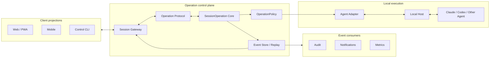

# Kaxu Architecture

Kaxu is a local-first control plane for AI coding agents. Its core contract is independent of any Agent provider, client framework, relay, or storage implementation.

## Architectural rule

```text
Reuse implementations. Own the operation contract.
```

Clients never call Claude, Codex, or another Agent directly. Provider behavior is normalized by an adapter before it reaches the operation core.

## Layers



## Core abstractions

### `SessionOperation`

The smallest business unit. It keeps a stable `operationId` across request, approval, execution, completion, failure, cancellation, and audit.

### `OperationCommand`

An actor's intent. A command may be accepted, denied, delayed, or rejected as invalid. It is not a historical fact.

### `OperationEvent`

An immutable fact emitted after validation or execution. Events are ordered and replayable.

### `OperationPolicy`

Evaluates whether an action is allowed, denied, or waiting for approval. Provider-specific permission modes are mapped into this shared policy boundary.

### `CapabilityManifest`

Declares what an adapter supports. Clients render capabilities rather than checking provider names.

### `Projection`

Renders operations for Web, mobile, CLI, notifications, audit, or another consumer without owning the source business state.

## Dependency direction

```text
apps -> protocol -> operation-core
host -> adapter-sdk -> protocol
provider adapters -> adapter-sdk
transport and storage -> ports defined by the core
```

`operation-core` must not import provider SDKs, UI frameworks, network transports, or storage engines.

## Extension rules

- New Agent: implement `AgentAdapter` and declare a `CapabilityManifest`.
- New client: consume events and dispatch commands through the public protocol.
- New feature: define the command, events, state transition, and policy behavior.
- New consumer: subscribe to `OperationEvent` without modifying the core.
- New infrastructure: implement an existing port rather than changing domain types.
